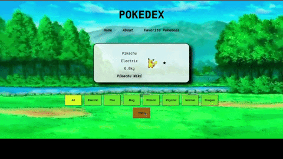

# Projeto Pokedéx

# Contexto
Este projeto trata-se de uma simulação de uma Pokedéx, onde o objetivo foi colocar em pratica os aprendizados em Redux, Rotas, Ciclos de vida do React e salvar estados no local storage.

Temos 3 menus de navegação, sendo eles `Home`, `About` e `Favorite Pokemons`:

## Home
Na pagina `Home` temos uma pequena lista de Pokemons e alguns filtros de navegação onde podemos filtrar de acordo com o tipo de Pokemon e navegar entre os Pokemons apenas daquele tipo.
Tendo uma ilustração do Pokemon e um link `Wiki` que fornece mais informações sobre aquele Pokemon especifico, nessa pagina podemos favoritar e desfavoritar um Pokemon.



## About
Na pagina `About` temos um breve resumo do que é uma Pokedéx, e uma imagem ilustrativa de uma modelo de Pokedéx.


## Favorite Pokemons
Na pagina de `Favorite` temos todos os Pokemons marcados como favoritos.


As alterações de favoritos são salvas no local storage e são mantidas/restauradas ao atualizar a pagina.

## Técnologias usadas

Front-end:
> Desenvolvido usando: React, CSS3, HTML5, ES6

## Instalando Dependências

``` bash
npm install
``` 
## Executando aplicação

  ``` bash
  npm start
  ```